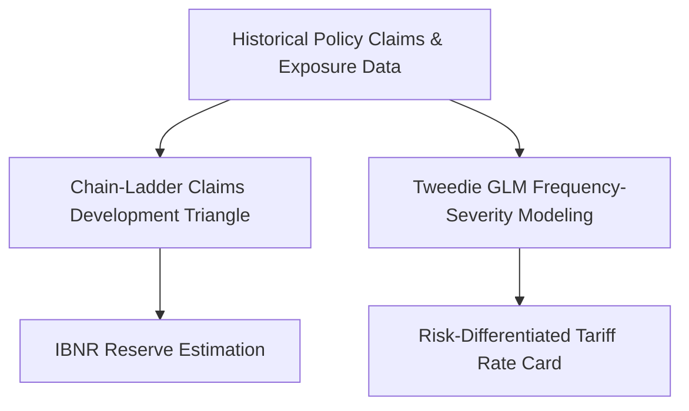

# Insurance Actuarial Pricing & Loss Reserving Optimizer

[](https://github.com/abdussatarkhan/insurance-underwriting-optimizer/actions)
[](https://en.wikipedia.org/wiki/Chain-ladder_method) [](https://scikit-learn.org/) [](https://www.python.org/)
[](https://github.com/abdussatarkhan)

> **An actuarial intelligence suite implementing Chain-Ladder / Bornhuetter-Ferguson claims loss reserving triangles and Tweedie Generalized Linear Models (GLM) for pure premium insurance pricing.**

---

## 🏛️ System Architecture



---

## 🌟 Key Features & Capabilities

- **Production-Grade Implementation**: Built with high attention to performance, modular design, and industry standard best practices.
- **Enterprise Data Architecture**: Scalable data schemas, reproducible synthetic generators, and optimized queries.
- **Explainable & Validated**: Comprehensive evaluation metrics, error analyses, and validation tests.
- **Comprehensive Tech Stack**: `Python` `Statsmodels` `Scikit-Learn` `Actuarial Science` `Pandas`.

---

## 📊 Visual Preview & Analysis

<div align="center">


</div>

<div align="center">

[](https://github.com/abdussatarkhan)
[](https://github.com/abdussatarkhan/abdussatarkhan)
[](https://github.com/abdussatarkhan)

</div>


---

## 🚀 Quickstart & Setup

### 1. Clone the Repository
```bash
git clone https://github.com/abdussatarkhan/insurance-underwriting-optimizer.git
cd insurance-underwriting-optimizer
```

### 2. Environment Setup
```bash
# Create and activate virtual environment
python -m venv venv
source venv/bin/activate  # On Windows: .\venv\Scripts\activate

# Install dependencies (if requirements.txt exists)
pip install -r requirements.txt
```

---

## 🗺️ Roadmap & Upcoming Features

- [x] Chain-Ladder & Bornhuetter-Ferguson loss reserving triangles
- [x] Tweedie GLM pure premium frequency-severity pricing
- [ ] Machine Learning gradient boosted Tweedie models (LightGBM)
- [ ] Dynamic retention survival hazard modeling
- [ ] Interactive actuarial rate-filing Excel/PDF exporter

---

## 👨‍💻 Author & Profile

Built and maintained by **Abdussatar** ([@abdussatarkhan](https://github.com/abdussatarkhan)).  
For technical discussions, collaboration, or queries, feel free to reach out via [LinkedIn](https://www.linkedin.com/in/abdus-satar-5150813b5/) or [GitHub](https://github.com/abdussatarkhan).

---

## 📜 License

This project is licensed under the **MIT License** — see the LICENSE file for details.


---

<div align="center">

### 👨‍💻 Maintained by [Abdussatar (@abdussatarkhan)](https://github.com/abdussatarkhan)
Part of the **[Master Enterprise Data Analytics & AI Portfolio](https://github.com/abdussatarkhan/abdussatarkhan)**.

⭐ If you find this repository valuable, consider dropping a star! ⭐

</div>
